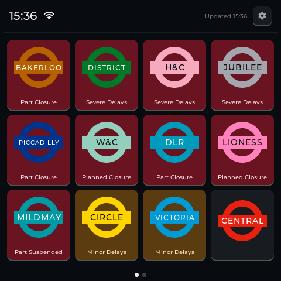
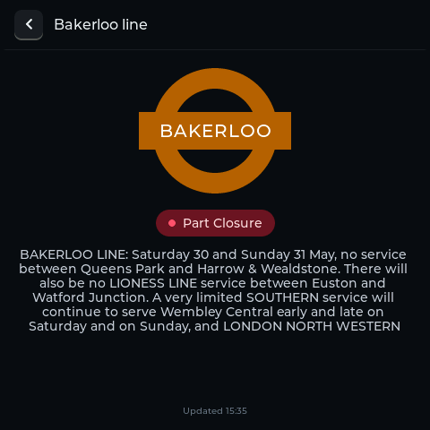
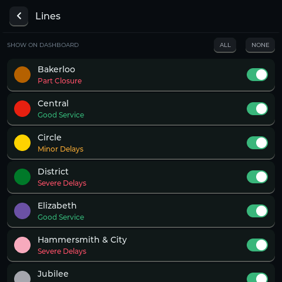

# Tube Status Display
A display which will show the status of London's tube, DLR, Overground & Elizabeth lines. This has been designed to run on the ESP32-4848S040 display, which includes a built in ESP32-S3 as well as 480x480 IPS display.

  

## Features
- Line Overviews
- Detailed Information
- Customise which lines you're interested in

## Gallery

  

  

## Building
To build this for your own display, simply clone this repo, open it with PlatformIO in VSCode and build & upload.

Navigate to settings -> Wi-Fi and enter your credentials to allow it to start pulling data

## Data Sources
This uses data from [TFL's Unified Data API](https://api-portal.tfl.gov.uk), which is called every 30 seconds to make sure it's as up to date as possible
